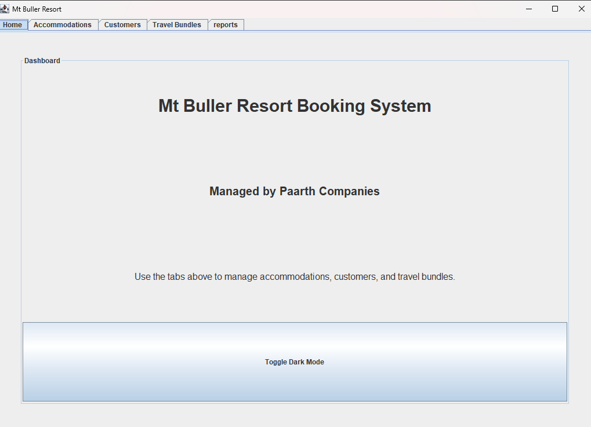
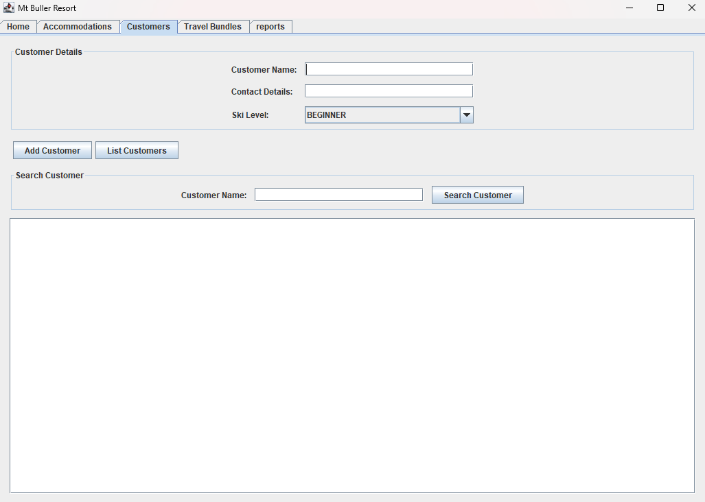
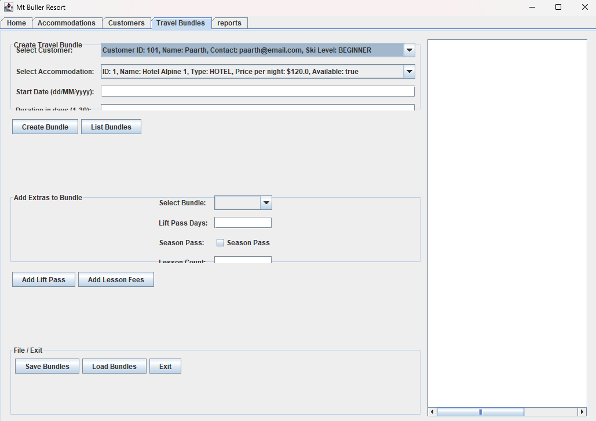

# resort-management-system-java
# Resort Management System

A Java Swing desktop application developed as part of Programming A.

## Overview

The Resort Management System is a Java Swing desktop application that allows users to manage customers, accommodations, lessons, lift passes, and travel bundles for a ski resort.

The project was developed using object-oriented programming principles and includes data persistence through serialization.

## Features

- Customer management
- Accommodation management
- Travel bundle creation
- Save and load data using serialization
- Graphical User Interface using Java Swing

## Technologies Used

- Java
- Java Swing
- Object-Oriented Programming
- ArrayLists
- File Handling
- Serialization

## Project Structure

- ResortGUI.java - Main graphical interface
- MtBullerResort.java - Core business logic
- TravelBundle.java - Travel package management
- LodgeRoom.java - Accommodation management
- Lesson.java - Lesson booking management
- LiftPass.java - Lift pass management

## What I Learned

- GUI development with Swing
- Event handling using ActionListener
- Object-oriented design principles
- Data storage using serialization
- Managing collections with ArrayLists

## Screenshots

### Main Dashboard

### Customers

### Travel Bundles

## Running the Project

1. Clone the repository
2. Open in VS Code or IntelliJ
3. Run Main.java

## Author

Paarth Jatwani
